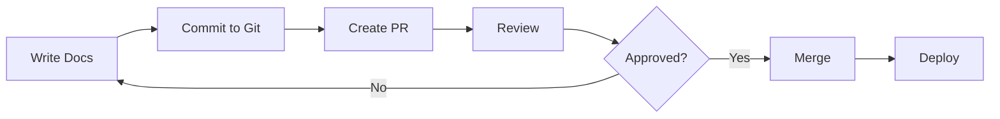

# Product Documentation System
## Technical Overview & Best Practices

**Prepared by:** Technical Writing Team
**Email:** 24ds2000040@ds.study.iitm.ac.in
**Date:** November 2025

---

<!-- _backgroundImage: url('marp.jpeg') -->
<!-- _color: white -->

# Welcome to Our Documentation Platform

A comprehensive guide to creating maintainable, version-controlled documentation

---

## Table of Contents

1. Introduction to Documentation Systems
2. Version Control Best Practices
3. Algorithmic Complexity Analysis
4. Format Conversion Tools
5. Maintenance Guidelines

---

## Why Marp for Documentation?

**Key Benefits:**

- ✅ **Version Control Friendly** - Plain Markdown files work seamlessly with Git
- ✅ **Multiple Output Formats** - Export to PDF, HTML, PPTX
- ✅ **Easy Collaboration** - Team members can review and suggest changes
- ✅ **Consistent Styling** - Custom themes ensure brand consistency
- ✅ **Developer Friendly** - Write documentation like code

---

## Version Control Integration

### Git Workflow for Documentation

```bash
# Create a new documentation branch
git checkout -b docs/new-feature

# Add your Marp slides
git add slides.md

# Commit with descriptive message
git commit -m "Add product feature documentation"

# Push to repository
git push origin docs/new-feature
```

> **Best Practice:** Use pull requests for documentation reviews

---

## Algorithmic Complexity in Documentation Processing

### Time Complexity Analysis

When processing large documentation sets, consider:

**Markdown Parsing Complexity:**

$$
T(n) = O(n)
$$

Where $n$ is the number of characters in the document.

**Search Index Building:**

$$
T(n, m) = O(n \cdot m)
$$

Where:
- $n$ = number of documents
- $m$ = average document length

---

## Space Complexity Considerations

### Memory Usage for Document Storage

**Linear Space Complexity:**

$$
S(n) = O(n)
$$

**Indexed Search Space:**

$$
S_{index}(n, k) = O(n \cdot k)
$$

Where:
- $n$ = total documents
- $k$ = average keywords per document

**Optimization Goal:** Minimize $k$ while maintaining search quality

---

## Format Conversion Tools

### Supported Output Formats

| Format | Use Case | Command |
|--------|----------|---------|
| **PDF** | Print, Distribution | `marp slides.md --pdf` |
| **HTML** | Web Publishing | `marp slides.md --html` |
| **PPTX** | PowerPoint | `marp slides.md --pptx` |

### Installation

```bash
# Install Marp CLI
npm install -g @marp-team/marp-cli

# Convert to PDF
marp slides.md --pdf --allow-local-files
```

---

## Custom Styling Examples

### Code Syntax Highlighting

```python
def generate_documentation(content):
    """
    Generate formatted documentation
    Time Complexity: O(n)
    """
    processed = markdown_to_html(content)
    return apply_theme(processed)
```

### Mathematical Notation

The Big O notation for our search algorithm:

$$
O(\log n) \ll O(n) \ll O(n \log n) \ll O(n^2)
$$

---

## Documentation Maintenance Guidelines

### Update Frequency

- **Product Changes:** Update within 24 hours
- **Bug Fixes:** Document immediately
- **Feature Additions:** Concurrent with release
- **API Changes:** Version-specific documentation

### Review Process

1. **Author** creates documentation
2. **Peer Review** by team member
3. **Technical Review** by subject matter expert
4. **Approval** by documentation lead

---

## Best Practices Summary

### Do's ✅

- Use semantic versioning for documentation
- Include code examples and use cases
- Write clear, concise explanations
- Test all code snippets
- Keep formatting consistent

### Don'ts ❌

- Don't skip version control
- Avoid overly technical jargon
- Don't forget to update screenshots
- Avoid long paragraphs without breaks

---

## Version Control Workflow Diagram



---

## Mathematical Formula Examples

### Complexity Classes

**Polynomial Time:**
$$
P = \{L \mid L \text{ is decidable in } O(n^k) \text{ time}\}
$$

**Exponential Time:**
$$
EXPTIME = \{L \mid L \text{ is decidable in } O(2^{n^k}) \text{ time}\}
$$

**Space Complexity Relationship:**
$$
SPACE(f(n)) \subseteq TIME(2^{O(f(n))})
$$

---

## Performance Metrics

### Documentation Build Times

| Document Size | Parse Time | Render Time | Total |
|--------------|------------|-------------|-------|
| Small (<100 slides) | 0.5s | 1.2s | 1.7s |
| Medium (100-500) | 2.1s | 5.4s | 7.5s |
| Large (>500) | 8.3s | 21.2s | 29.5s |

**Optimization Strategy:** 
- Use incremental builds: $O(\Delta n)$ instead of $O(n)$

---

## Tools and Resources

### Essential Tools

- **Marp CLI** - Command-line presentation tool
- **VS Code + Marp Extension** - Live preview
- **Git/GitHub** - Version control
- **Pandoc** - Universal document converter
- **MathJax** - Mathematical notation rendering

### Documentation

- Official Marp Documentation: https://marpit.marp.app/
- Markdown Guide: https://www.markdownguide.org/
- Git Documentation: https://git-scm.com/doc

---

## Contact & Support

### Get in Touch

📧 **Email:** 24ds2000040@ds.study.iitm.ac.in

💬 **Support Channels:**
- Internal Slack: #documentation
- GitHub Issues: Report bugs and suggestions
- Wiki: Knowledge base and tutorials

### Office Hours
- Monday - Friday: 9:00 AM - 5:00 PM IST
- Response Time: Within 24 hours

---

<!-- _class: lead -->
<!-- _paginate: false -->

# Thank You!

## Questions?

**Remember:** Great documentation is maintainable documentation

**Contact:** 24ds2000040@ds.study.iitm.ac.in

---

## Appendix: Additional Resources

### Further Reading

1. **"Docs Like Code"** - Anne Gentle
2. **"The Product is Docs"** - Splunk Documentation Team
3. **Technical Writing Style Guides** - Google, Microsoft

### Command Reference

```bash
# Watch mode for live updates
marp -w slides.md

# Custom theme
marp --theme custom-theme.css slides.md

# With templates
marp --template template.html slides.md
```
